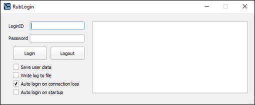

# RUB Login
An automatic login client for the [RUB](https://www.ruhr-uni-bochum.de/en) internet access written in Python

## Abstract
A login client for the RUB university internet access.
Necessary to stay connected since clients in student housings are kicked after being online for 24 hours. Username and password are encrypted and
saved locally for convenience.

## Installation
Requirements: Python, Qt

```
$ python RubLogin.py
```

## Screenshot
<p align="center">
	
</p>

## Third party libraries
[PyQt](https://riverbankcomputing.com/software/pyqt/intro)
